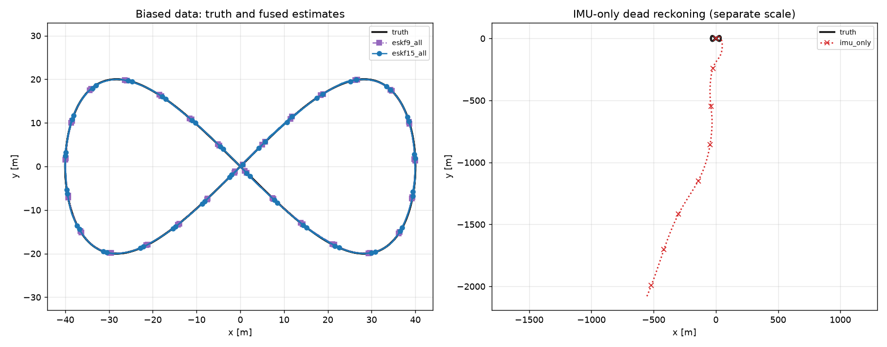

# vehicle-localization-eskf

Estimate a vehicle's motion from noisy sensors using an **error-state Kalman filter (ESKF)**.

> **Status: working.** All required steps are implemented and tested: 140 tests pass, and every engineering target was met on seeds 7, 23 and 42. The results below come from real runs on a remote cloud machine, **not** the target laptop. Re-run `demo` to get numbers for your own machine.

---

## Step 1 — Understand the goal

- A vehicle moves along a known path.
- Its sensors are noisy.
- The filter estimates where the vehicle is from those sensors.
- We compare that estimate with the true path.

---

## Step 2 — Know the sensors

| Sensor | Rate | What it gives |
|---|---|---|
| IMU | 100 Hz | Acceleration and turn rate |
| GNSS | 5 Hz | Rough position (about 1 m error) |
| LiDAR localizer | 10 Hz | Better position (about 0.15 m error) |

- All sensor data is **simulated**.
- "LiDAR localizer" means a simulated position output, **not** real LiDAR scans.

---

## Step 3 — Know what we estimate

- Position
- Velocity
- Orientation (stored as a quaternion)
- IMU biases (only in the final filter)

---

## Step 4 — Learn the conventions

- World frame: `z` points up.
- Body frame: `x` forward, `y` left, `z` up.
- Quaternions are stored as `[qx, qy, qz, qw]`.
- Gravity is `[0, 0, -9.80665] m/s²`.
- Units are metres, seconds and radians.
- Timestamps in files are integer nanoseconds.

---

## Step 5 — Generate the data

- Make a 120-second figure-eight path.
- Create IMU, GNSS and LiDAR readings from it.
- Add noise using a fixed seed (default `7`).
- Save everything to CSV and JSON.

---

## Step 6 — Try IMU only

- Integrate the IMU readings with no corrections.
- Watch the error grow over time.
- This shows **why** we need a filter.

---

## Step 7 — Build the 9-state filter

- Estimates position, velocity and orientation.
- Assumes the IMU has no bias.
- Corrects itself with GNSS and LiDAR positions.

---

## Step 8 — Build the 15-state filter

- Adds accelerometer bias and gyroscope bias.
- Learns the biases while it runs.
- This is the final estimator.

---

## Step 9 — Compare five setups

| Name | What it uses |
|---|---|
| `imu_only` | IMU only |
| `eskf9_gnss` | 9-state + GNSS |
| `eskf9_all` | 9-state + GNSS + LiDAR |
| `eskf15_gnss` | 15-state + GNSS |
| `eskf15_all` | 15-state + GNSS + LiDAR |

All five use the same data, so the comparison is fair.

---

## Step 10 — Run the experiments

| ID | What we test |
|---|---|
| E0 | Simple noise-free cases |
| E1 | IMU only vs. 9-state filter |
| E2 | 9-state vs. 15-state with biased IMU |
| E3 | GNSS lost for 20 s, no LiDAR |
| E4 | GNSS lost for 20 s, LiDAR still on |
| E5 | Both sensors lost for 20 s |
| E6 | Filter trusts GNSS too much or too little |
| E7 | Wrong LiDAR mounting position |
| E8 | Fake GNSS outliers, rejection on vs. off |

---

## Step 11 — Check the results

- Position, velocity and orientation errors (RMSE).
- Uncertainty bounds compared with the actual error.
- How many bad measurements were rejected.
- Plots and a generated report.

Measured results (seed 7; see [docs/results/report.md](docs/results/report.md)). RMSE is computed after a 10 s burn-in:

| Setup | Data | Position RMSE | What it shows |
|---|---|---|---|
| `imu_only` | biased | 1051 m | Dead reckoning drifts badly |
| `eskf9_gnss` | zero-bias | 0.61 m | GNSS alone fixes the drift |
| `eskf9_all` | biased | 0.16 m | Ignoring the bias leaves errors outside the filter's 3σ bounds (78% coverage on the worst axis) |
| `eskf15_all` | biased | **0.096 m** | Estimating the bias: 99.9% coverage |

| Experiment | Result |
|---|---|
| E3: GNSS lost, no LiDAR | Error grows to 15 m during the 20 s outage |
| E4: GNSS lost, LiDAR still on | Error stays below 0.19 m |
| E5: both lost | Error grows to 23 m, then recovers to about 0.15 m within 5 s |
| E6: GNSS trusted 10× too much | The GNSS-only filter rejects 581 of 600 fixes and diverges |
| E7: lever arm 0.22 m wrong | RMSE rises to 0.25 m while NIS barely changes |
| E8: 5% GNSS outliers | 100% of outliers rejected; 0.35% of clean fixes rejected |

Multi-seed check (seeds 7, 23, 42): `eskf15_all` position RMSE was 0.096, 0.099 and 0.096 m, all below the 1.0 m target. See [docs/results/verification_report.md](docs/results/verification_report.md).



---

## Step 12 — Install it

You need Python 3.11 or 3.12. No GPU is needed.

**Windows PowerShell**

```powershell
py -3.11 -m venv .venv
.\.venv\Scripts\python.exe -m pip install -e ".[dev]"
```

**Linux / WSL**

```bash
python3.11 -m venv .venv
.venv/bin/python -m pip install -e '.[dev]'
```

---

## Step 13 — Run it

Run everything in one go:

```bash
python -m vehicle_localization demo
```

Or one step at a time:

```bash
python -m vehicle_localization doctor                      # check Python, RAM, disk, packages
python -m vehicle_localization generate --config configs/default.yaml --output data/generated/default
python -m vehicle_localization validate --data data/generated/default
python -m vehicle_localization run --data data/generated/default --mode eskf15_all --output results/baseline
python -m vehicle_localization suite --config configs/default.yaml --seeds 7 --output results/suite
python -m vehicle_localization verify --config configs/default.yaml --seeds 7 23 42 --output results/verification
python -m pytest -q
```

`run` options:

- `--mode`: if you leave it out, the mode comes from `estimator.mode` in the config.
- `--dropout STREAM:START_S:END_S` (repeatable, for example `--dropout gnss:40:60`): `STREAM` must
  be `gnss` or `lidar`, the times must be finite, and start must be less than end. Bad requests are
  rejected before anything runs. The run prints how many measurements each interval removed, and
  warns if an interval removed none.

Optional, and only when you want it: `python -m vehicle_localization monte-carlo --runs 20 --output results/monte_carlo`.
`--runs` must be a positive integer. Every mode works, including `imu_only`, which reports NIS as "n/a".

On Windows, put `.\.venv\Scripts\python.exe` in front of each command instead of `python`. Use `--config configs/smoke.yaml` for a fast 10-second version.

Exit codes:

| Code | Meaning |
|---|---|
| `0` | Success |
| `1` | A check or a run failed |
| `2` | Runs finished, but an engineering target was not met |

Outputs never overwrite an existing folder. A new timestamped folder is created unless you pass `--overwrite`.

Measured on the remote cloud machine (4-core Xeon, not the target laptop):

| Command | Time | Peak memory | Output size |
|---|---|---|---|
| `demo` | 75 s | 254 MB | 155 MB |
| One filter run | about 2.5 s | — | — |

---

## Step 14 — Know the limits

- Synthetic data only.
- Localization only: no mapping.
- No neural networks.
- Offline processing, not real-time.
- The path is flat (2-D motion inside a 3-D filter).
- The starting point comes from the true state plus some noise (ground-truth-assisted).
- The GNSS and LiDAR errors are independent white noise. Real sensors have correlated, slowly drifting errors.
- Yaw and the vertical gyro bias are only weakly observable from position measurements. They improve during turns.
- Only a lever-arm (translation) calibration error was tested, not a rotation (boresight) error.

---

## Documentation

| File | What it covers |
|---|---|
| [docs/project_plan.md](docs/project_plan.md) | The whole project as small steps |
| [docs/math.md](docs/math.md) | Every equation and convention used |
| [docs/data_format.md](docs/data_format.md) | Files, columns, units and timing rules |
| [docs/learning_guide.md](docs/learning_guide.md) | Explains the ideas in build order, with measured examples |
| [docs/recorded_data.md](docs/recorded_data.md) | How to use your own recorded data |
| [docs/results/](docs/results/) | Snapshot of the generated reports and figures |

## Background

- Main reference: J. Solà, [Quaternion kinematics for the error-state Kalman filter](https://arxiv.org/abs/1711.02508).

## License

MIT. See [LICENSE](LICENSE).
